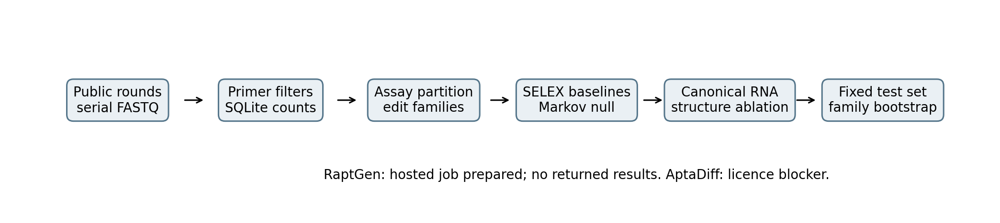
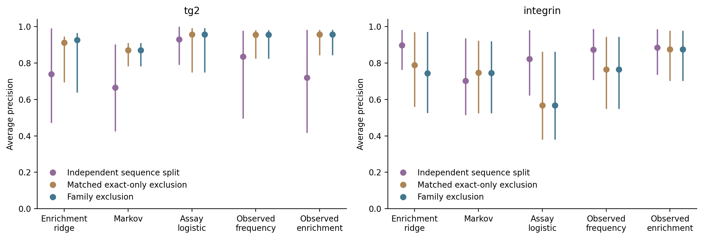
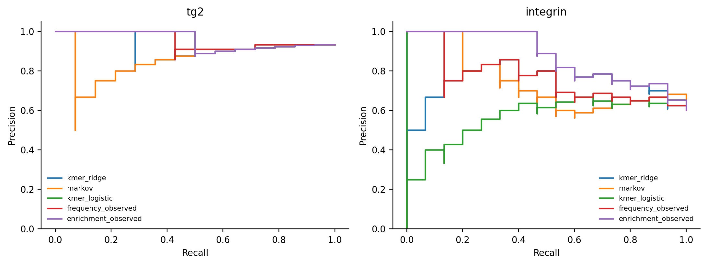
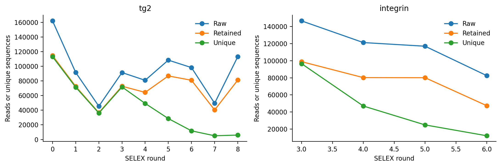
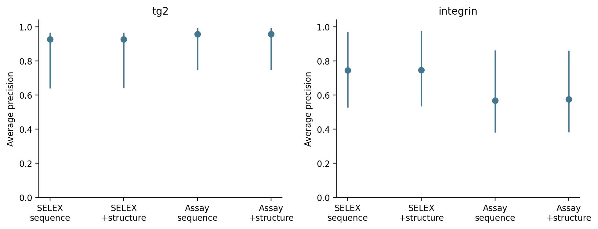
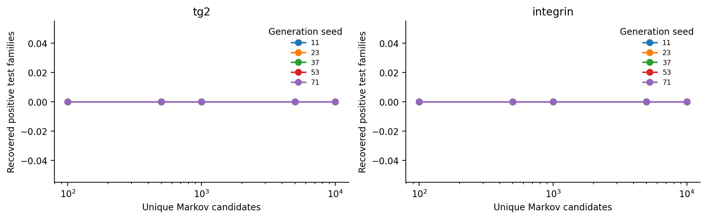
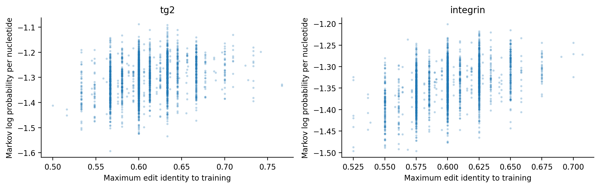
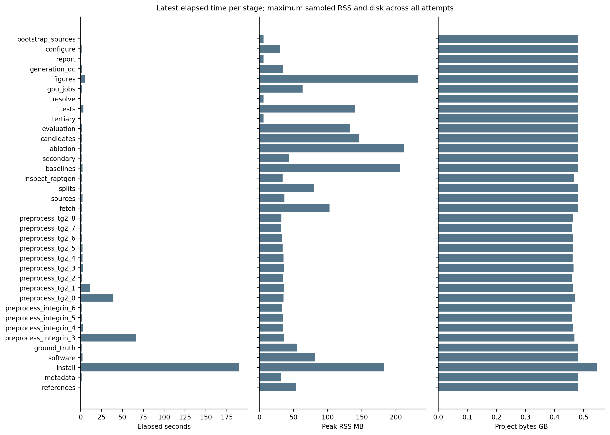

# Executed local analysis report

## Summary

TG2's grouped test set has 1 negative sequence among 15 sequences. Its prevalence baseline is 0.933 average precision (AP), compared with 0.926 for the SELEX-trained k-mer model. Integrin's grouped k-mer AP is 0.744; observed enrichment is 0.875. The latter uses test-sequence counts and is an observational reference. Adding canonical-RNA structural features changes integrin ridge AP by +0.0031, with a family-bootstrap interval spanning zero. The Markov null generated 100,000 unique candidates across all target-seed runs and recovered 0 exact test sequences and 0 positive test families. RaptGen has a hosted job but no returned run. AptaDiff is excluded pending explicit repository licensing and an authorized adapter. The largest observed local footprint is 0.546 GB, including the environment and temporary files. Sources: [summary](results/summary.tsv), [metrics](results/evaluation_metrics.tsv), [generation](results/generation_statistics.tsv), [resources](logs/resource_usage.tsv).

## Background

Aptamers bind through a molecular conformation formed by their sequence and chemical context. SELEX repeatedly partitions molecules and amplifies survivors. HT-SELEX sequences those pools. Read abundance can reflect selection, PCR bias or a bottleneck; it is not an independent affinity measurement. A model trained on target-specific selection data can learn that distribution. A different target without such data is a different scientific problem.

Related sequences can share motifs and appear on both sides of a sequence split. Here, exact edit-distance components define families at an arbitrary preregistered identity of 80%. Indels count. Secondary structure supplies an intramolecular folding proxy; a predicted tertiary fold or model ranking does not establish binding. **This pipeline does not claim that an aptamer can be reliably designed for an arbitrary target from its protein sequence or structure alone.**

## Data

| Target / accession | Rounds processed | Raw reads | Retained reads | Discarded reads | Assays retained / excluded | Primary test / families |
| --- | --- | --- | --- | --- | --- | --- |
| tg2 / DRA009383 | 9 | 840620 | 650294 | 190326 | 30 / 0 | 15 / 6 |
| integrin / DRA009384 | 4 | 467095 | 306561 | 160534 | 48 / 0 | 25 / 24 |

These RNA libraries contain 2'-fluoro pyrimidines. The primary supplement defines transcribed-strand primer filters and permits length intervals around the nominal library lengths. No assay sequence was excluded for an indel. Every rejection class is retained in [preprocessing counts](results/preprocessing_counts.tsv). Reads were not subsampled. Training-pool capping excluded 0 eligible TG2 sequences and 59 eligible integrin sequences before family construction; the selected pools contain 1893 and 2500 sequences. The primary family rule then excludes 83 and 298 pool members, respectively, from generator fitting.

The RaptRanker primary supplement provides original Positive/Negative labels and continuous end-of-injection SPR response in RU. We preserve both and introduce no binary cutoff. [Ground-truth audit](results/ground_truth_audit.tsv) and [each original measurement](config/ground_truth_manifest.tsv) retain provenance. [RaptRanker](https://doi.org/10.1093/nar/gkaa484) establishes the target identities. The ENA mirror provides the DDBJ-submitted study and experiment records.

[AptaDiff](https://pmc.ncbi.nlm.nih.gov/articles/PMC11491854/) distinguishes its IGFBP3/PTK7 datasets A/B from public TG2/integrin C/D in Table 1, while its availability sentence assigns the DRA accessions to A/B. Repository primer and length measurements support keeping these biological datasets distinct. The accession sentence and A/B public accessions remain unresolved. Four inspected repository data files are excluded from benchmark training; the official complete rounds are used instead. Details remain in [data provenance](results/data_provenance.tsv).

## Pipeline

`bash scripts/00_configure.sh --threads 1 --ram 16 --disk 13 --gpu-mode none --yes` measures free space, preserves an external reserve and writes project.conf. Source checks and installation precede sequencing. `bash scripts/04_fetch_selex.sh` downloads one file, checks size and MD5, counts with SQLite, verifies compact output and deletes raw input. The measured pilot supplies the [disk projection](results/disk_projection.tsv).

`bash run_all.sh --mode core --from 06` reconstructs ground truth, families, baselines, structure, candidates and statistics. Every stage uses the resource wrapper. Configuration and output hashes govern restart decisions. The scientific definitions and alternatives are explained in [methods](docs/methods.md) and the [score dictionary](docs/score_dictionary.md).

The grouped primary arm excludes every test family from training. The matched exact-only diagnostic shares the same assay test IDs and allows their relatives in training. It is stored as `random` but is not an independent random partition. A separate `naive_sequence_random` arm provides that partition. It was added after the first local run to correct this diagnostic definition; no performance-driven seed selection occurred. Its test cases differ, so its difference from the primary arm is not a paired leakage estimate. Both diagnostics remain visible. The family-aware audits have zero exact and family overlaps.

The complete local data flow ends at fixed experimental test cases; missing neural jobs are shown explicitly.



## Results

Held-out AP must be judged against prevalence. TG2 has only one negative test sequence, so a high AP gives weak evidence of discrimination.

| Method | TG2 grouped AP (95% interval) | Integrin grouped AP (95% interval) |
| --- | --- | --- |
| frequency | 0.933 (0.692 to 0.957) | 0.600 (0.400 to 0.792) |
| enrichment | 0.933 (0.692 to 0.957) | 0.600 (0.400 to 0.792) |
| kmer_ridge | 0.926 (0.639 to 0.965) | 0.744 (0.526 to 0.971) |
| markov | 0.870 (0.782 to 0.910) | 0.745 (0.524 to 0.920) |
| kmer_logistic | 0.957 (0.748 to 0.992) | 0.568 (0.380 to 0.862) |
| kmer_structure_ridge | 0.926 (0.642 to 0.965) | 0.747 (0.533 to 0.974) |
| kmer_structure_logistic | 0.957 (0.748 to 0.992) | 0.574 (0.382 to 0.860) |
| frequency_observed | 0.955 (0.825 to 0.982) | 0.765 (0.549 to 0.945) |
| enrichment_observed | 0.957 (0.844 to 0.983) | 0.875 (0.702 to 0.977) |

`frequency_observed` and `enrichment_observed` query original read counts. Exact-lookup `frequency` and `enrichment` use filtered training counts and become constant after exact test exclusion. Neither constant score is hidden. The ridge model predicts SELEX enrichment; logistic fitting uses training assay labels only. Its output is an uncalibrated decision function, not a probability or KD. Full AUROC, rank correlations, top-ranked precision and undefined-score statuses are in [evaluation metrics](results/evaluation_metrics.tsv).

The same k-mer model has different performance under the independent naive partition and the controlled exclusion diagnostic.

| Target | Independent naive random AP | Matched exact-only AP | Family AP |
| --- | --- | --- | --- |
| tg2 | 0.739 | 0.912 | 0.926 |
| integrin | 0.898 | 0.789 | 0.744 |



The grouped precision-recall curves include the observational references and preserve the losing local methods.



Processing retains the full round trajectory, including later TG2 rounds that the original RaptRanker analysis excluded because negative-labelled sequences amplified.



Structure-minus-sequence ridge changes are tg2: +0.0000 (95% -0.0074 to +0.0084); integrin: +0.0031 (95% -0.0207 to +0.0259). These are paired comparisons on identical test cases with sequence-family bootstrap resampling; they exclude training uncertainty.



The Markov null recovers no positive experimental test family at the configured budgets in this run. All generation seeds remain in the denominator.



Novelty is measured against the actual filtered training pool. The plotted points are the first fixed subset from each seed; full distributions and nearest sequences remain in generated data.



At the sensitivity threshold, an integrin assay-supervised fit lacks both training classes and is excluded in the grouped arm, including its structural variant. Both exclusions are logged. Two optional methods, AptaDiff and InstructNA, have unclear repository licensing. RaptGen is not executed because no hosted result has returned. No tertiary method runs. These unavailable results cannot support an architectural comparison.

The largest observed local footprint stays below the configured ceiling. Initial installation RSS was not captured by the first wrapper version; that row remains marked unavailable. Subsequent stages use the corrected process sampler. [Failure records](logs/failures.tsv) retain the metadata-route failures, test-fixture repair and any failed stage. The largest measured stage RSS is 233.2 MB and the minimum observed free space is 17.385 GB. RSS and disk are sampled, so brief peaks may be missed.



| Stage | Latest elapsed s | Peak RSS MB | Observed project GB |
| --- | --- | --- | --- |
| references | 0.874 | 2.8 | 0.481 |
| metadata | 1.107 | 28.4 | 0.481 |
| install | 190.033 | 182.9 | 0.546 |
| software | 2.413 | 70.8 | 0.481 |
| ground_truth | 1.101 | 27.8 | 0.481 |
| preprocess_integrin_3 | 66.264 | 35.8 | 0.468 |
| preprocess_integrin_4 | 2.545 | 35.1 | 0.464 |
| preprocess_integrin_5 | 2.140 | 34.3 | 0.462 |
| preprocess_integrin_6 | 1.267 | 33.2 | 0.459 |
| preprocess_tg2_0 | 39.352 | 35.3 | 0.469 |
| preprocess_tg2_1 | 11.075 | 35.5 | 0.464 |
| preprocess_tg2_2 | 1.685 | 34.6 | 0.459 |
| preprocess_tg2_3 | 3.211 | 35.6 | 0.465 |
| preprocess_tg2_4 | 2.235 | 35.4 | 0.462 |
| preprocess_tg2_5 | 2.198 | 34.1 | 0.464 |
| preprocess_tg2_6 | 1.507 | 32.6 | 0.463 |
| preprocess_tg2_7 | 1.146 | 32.0 | 0.461 |
| preprocess_tg2_8 | 1.264 | 32.3 | 0.464 |
| fetch | 1.510 | 27.9 | 0.481 |
| sources | 2.188 | 35.1 | 0.481 |
| splits | 1.130 | 31.8 | 0.481 |
| inspect_raptgen | 1.504 | 34.0 | 0.466 |
| baselines | 2.195 | 119.0 | 0.481 |
| secondary | 1.178 | 6.2 | 0.481 |
| ablation | 1.163 | 20.8 | 0.481 |
| candidates | 1.987 | 44.4 | 0.481 |
| evaluation | 1.761 | 107.4 | 0.481 |
| tertiary | 0.994 | 6.2 | 0.481 |
| tests | 3.342 | 137.4 | 0.481 |
| resolve | 0.913 | 6.2 | 0.481 |
| gpu_jobs | 1.396 | 63.0 | 0.481 |
| figures | 6.505 | 233.2 | 0.481 |
| generation_qc | 1.359 | 34.3 | 0.480 |
| report | 1.282 | 35.1 | 0.481 |
| configure | 1.366 | 29.5 | 0.481 |
| bootstrap_sources | 0.913 | 4.1 | 0.481 |
| full_preflight | 0.950 | 6.2 | 0.481 |
| clean_clone | 4.983 | 210.1 | 0.482 |

## Repository structure

```text
config/       fixed decisions, primer design, assay and split manifests
scripts/      numbered stages, shared resource wrapper, plotting and reporting
remote/       pinned RaptGen job and explicit AptaDiff blocker
results/      compact measurements, provenance, predictions and uncertainty
../figures/      scripted PNG and PDF figures
logs/         resources, failures, restart hashes and verification
data/         ignored raw, compact, generated and external data
tests/        synthetic end-to-end, scientific and artifact checks
docs/         methods, score definitions and the executed report
```

## Usage

Resource context: 16 GB RAM, maximum 13.0 GB local footprint. Bash, Git and Python are required. The local environment has no CUDA toolkit, GPU PyTorch installation or neural checkpoint. Git Bash was used on Windows; Linux and WSL can use the same shell scripts with a compatible Python interpreter.

```bash
# Set PYTHON or BOOTSTRAP_PYTHON to a supported interpreter when PATH is ambiguous.
bash scripts/02_install.sh
bash scripts/00_configure.sh --threads 1 --ram 16 --disk 13 --gpu-mode none --yes
bash run_all.sh --mode smoke
bash run_all.sh --mode core
bash run_all.sh --mode core --from 10
# Execute and return hosted jobs as described in remote/README.md.
bash scripts/import_remote.sh --directory remote/returned/tg2_family   --job remote/bundles/raptgen_tg2_family/job.json
bash run_all.sh --mode full --gpu-mode hosted --from 11
bash scripts/18_verify.sh
```

The smoke test uses synthetic reads and requires no public-data download or GPU. The latest measured times and disk footprints are listed above. Resource summaries describe the logged rows present when the report started; their count is recorded in summary.tsv. Full mode explicitly refuses missing or excluded neural arms and the unfinished neural aggregation. Read [HANDOVER.md](HANDOVER.md) for the exact remaining tasks. `--target` limits retrieval; the comparative analysis requires processed data for both targets. A from-stage restart requires the preceding validated files. The report is [HTML](results/report.html), with [Markdown source](docs/analysis_report.md); Quarto is optional.

## Limitations

The independent test measurements are few, especially independent TG2 families. I am least confident in TG2 binary discrimination because its test partition has only one negative. The family threshold is arbitrary and its sensitivity changes exclusion and training-class availability. Hash capping can omit informative late-round sequences. Read counts are affected by amplification and selection biases. Reported bootstrap intervals exclude refitting and model selection uncertainty.

Canonical RNA folding does not reproduce the chemistry of 2'-fluoro-modified RNA exactly. MFE concerns intramolecular folding. None of the generated candidates has a new wet-lab assay. Neural environments are legacy stacks; hosted training and artifact return remain unverified. AptaDiff's licence contradiction blocks its implementation. Tertiary prediction is disabled and contributes no evidence. This run does not establish reliable aptamer design for a target without target-specific selection or functional data.

## Data availability

The public accessions are DRA009383 and DRA009384. [Run metadata](results/selex_manifest.tsv) records every remote FASTQ, provider checksum, file size and explicit round evidence. [Download provenance](results/download_manifest.tsv) supplies retrieval timestamps and local hashes. The primary supplement is fetched from the publisher's linked PDF and parsed directly. Retained compact scientific tables are tracked; raw reads, derived count tables, primary PDFs, large generation tables and model weights are not. The Bash commands above regenerate them. Inspection date and local run date are recorded in the manifests rather than inferred from filenames.

## Citation

Primary literature: [RaptRanker](https://doi.org/10.1093/nar/gkaa484), [RaptGen](https://doi.org/10.1038/s43588-022-00249-6), [AptaDiff](https://doi.org/10.1093/bib/bbae517), and the discussed, excluded [InstructNA](https://doi.org/10.1038/s43588-026-00965-3). Software references: [ViennaRNA](https://www.tbi.univie.ac.at/RNA/), [NumPy](https://numpy.org/citing-numpy/), [SciPy](https://scipy.org/citing-scipy/), [scikit-learn](https://jmlr.org/papers/v12/pedregosa11a.html), [Matplotlib](https://matplotlib.org/stable/project/citing.html), and [RapidFuzz](https://github.com/rapidfuzz/RapidFuzz). Families use this repository's exact graph construction and RapidFuzz global edit distances; VSEARCH is not a dependency. Sources and checks are in [citations](results/citations.tsv) and [software provenance](results/software_manifest.tsv).

## Licence

Original repository code is MIT under the configured author's identity. RaptGen is MIT and is installed separately only on the hosted path. AptaDiff's paper declares MIT, but its inspected repository lacks a licence file; its executable arm is excluded. InstructNA also lacks a clear repository licence and is excluded. ViennaRNA has its own custom licence with attribution and redistribution conditions. These terms are not replaced by this repository's MIT licence. No pretrained weight licence is assumed.

The RaptRanker article and supplement have their own CC-BY-NC terms. The original PDF and upstream datasets are not redistributed. Derived factual assay fields are attributed, with terms recorded in [data terms](results/data_terms.tsv). All installed dependency and licence records retain the date checked. The current evidence ends at the local baselines and canonical-RNA ablation.
